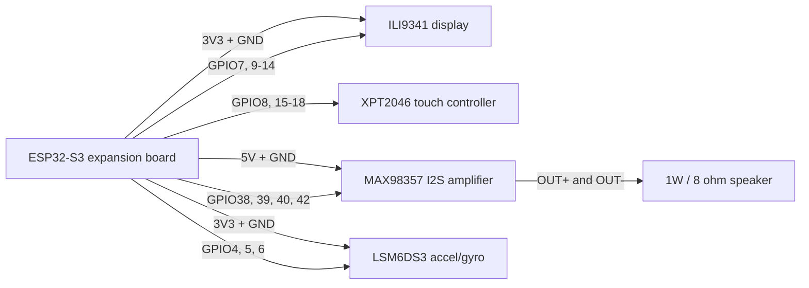

# Super Tamagotchi wiring

Current connector map for the ESP32-S3, ILI9341/XPT2046 display, MAX98357
speaker amplifier, and LSM6DS3 IMU.

> **Disconnect USB power before moving any wire.** All logic signals are 3.3V.
> The display is powered from 3.3V; only the MAX98357 `VIN` uses 5V.

## System diagram



## ESP32-S3 expansion headers

Follow the labels printed on the expansion board rather than relying on board
orientation. Each signal is available in two parallel sockets on its labelled
column.

```text
Side A
3V3 · GND · 4 · 5 · 6 · 7 · 15 · 16 · 17 · 18 · 8 · 3 · 9 · 10 · 11 · 12 · 13 · 14 · GND · 3V3

Side B
3V3 · 5V · GND · GND · 19 · 20 · 21 · 47 · 48 · 38 · 39 · 40 · 41 · 42 · 2 · 1 · GND · GND · 5V · 3V3
```

### Current GPIO use

| GPIO | Connected to | Purpose |
|---:|---|---|
| 7 | Display `LED` | Backlight control |
| 8 | Display `T_DO` | Touch MISO |
| 9 | Display `DC` | Display data/command |
| 10 | Display `CS` | Display chip select |
| 11 | Display `SDI(MOSI)` | Display MOSI |
| 12 | Display `SCK` | Display clock |
| 13 | Display `SDO(MISO)` | Display MISO |
| 14 | Display `RESET` | Display reset |
| 15 | Display `T_CS` | Touch chip select |
| 16 | Display `T_IRQ` | Touch interrupt |
| 17 | Display `T_DIN` | Touch MOSI |
| 18 | Display `T_CLK` | Touch clock |
| 38 | MAX98357 `BCLK` | I2S bit clock |
| 39 | MAX98357 `LRC` | I2S word/left-right clock |
| 40 | MAX98357 `DIN` | I2S audio data to amplifier |
| 42 | MAX98357 `SD` | Amplifier enable/mute |
| 4 | LSM6DS3 `SCL` | IMU I2C clock |
| 5 | LSM6DS3 `SDA` | IMU I2C data |
| 6 | LSM6DS3 `INT1` | IMU interrupt |

The display backlight moved from GPIO21 to GPIO7, so GPIO21 is free.

## Display and touch connector

| Display module pin | ESP32-S3 connection | Notes |
|---|---|---|
| `VCC` | `3V3` | Do not use 5V for this build |
| `GND` | `GND` | Shared ground |
| `CS` | GPIO10 | Display chip select |
| `RESET` | GPIO14 | Display reset |
| `DC` | GPIO9 | Data/command |
| `SDI(MOSI)` | GPIO11 | Display data from ESP32 |
| `SCK` | GPIO12 | Display clock |
| `LED` | GPIO7 | Backlight; moved from GPIO21 |
| `SDO(MISO)` | GPIO13 | Display data to ESP32 |
| `T_CLK` | GPIO18 | Touch clock |
| `T_CS` | GPIO15 | Touch chip select |
| `T_DIN` | GPIO17 | Touch data from ESP32 |
| `T_DO` | GPIO8 | Touch data to ESP32 |
| `T_IRQ` | GPIO16 | Touch interrupt |

The display module's separate microSD connector is intentionally not wired.

## MAX98357 amplifier and speaker

In the breakout's own silkscreen order:

| MAX98357 pin | Connection | Notes |
|---|---|---|
| `LRC` | GPIO39 | I2S word-select clock |
| `BCLK` | GPIO38 | I2S bit clock |
| `DIN` | GPIO40 | I2S audio data |
| `GAIN` | Not connected | Uses the breakout's default gain |
| `SD` | GPIO42 | Firmware hard-mutes the amp between sounds |
| `GND` | ESP32 `GND` | Must share ground with the ESP32 |
| `VIN` | ESP32 `5V` | Amplifier power |
| `OUT+` | Speaker `+` | Green screw terminal |
| `OUT-` | Speaker `-` | Green screw terminal; never connect to ground |

```text
ESP32-S3                         MAX98357                  Speaker
---------                        ---------                 -------
GPIO39 ------------------------> LRC
GPIO38 ------------------------> BCLK
GPIO40 ------------------------> DIN
                                  GAIN   (not connected)
GPIO42 ------------------------> SD
GND    ------------------------> GND
5V     ------------------------> VIN
                                  OUT+ -------------------> +
                                  OUT- -------------------> -
```

Never leave `VIN` disconnected while `BCLK`, `LRC`, `DIN`, or `SD` remain driven.
The amplifier can otherwise be phantom-powered through its signal inputs, causing
distortion and potentially damaging the hardware.

## LSM6DS3 IMU

I2C, on its own bus rather than shared with the display's SPI. `SDO` is tied to
`GND` so the part sits at I2C address `0x6A`.

| LSM6DS3 pin | Connection | Notes |
|---|---|---|
| `VIN` | `3V3` | **3.3V only** — not 5V tolerant |
| `GND` | `GND` | Shared ground |
| `SCL` | GPIO4 | I2C clock |
| `SDA` | GPIO5 | I2C data |
| `INT1` | GPIO6 | Interrupt (tap, wake, free-fall, etc.) |
| `SDO/SA0` | `GND` | Selects I2C address `0x6A` |
| `CS` | `3V3` | Ties the part into I2C mode |

```text
ESP32-S3                         LSM6DS3
---------                        -------
3V3    ------------------------> VIN
GND    ------------------------> GND
GPIO4  ------------------------> SCL
GPIO5  ------------------------> SDA
GPIO6  ------------------------> INT1
GND    ------------------------> SDO/SA0
3V3    ------------------------> CS
```

## Reserved and avoided pins

| GPIO | Status | Reason |
|---:|---|---|
| 3 | Do not use | Boot-strapping pin |
| 19, 20 | Reserved | Native USB data connection |
| 48 | Do not use | Onboard addressable RGB LED, confirmed by the board silkscreen |
| 21 | Free | Former display backlight pin |
| 41 | Reserved | Future microphone I2S data |
| 45, 46 | Not broken out / do not use | Boot-strapping pins |

GPIO45 is particularly unsuitable: its reset-time level selects the flash/PSRAM
voltage. Do not move a display signal to GPIO3, GPIO45, or GPIO46 merely to fill
an unused connector.

